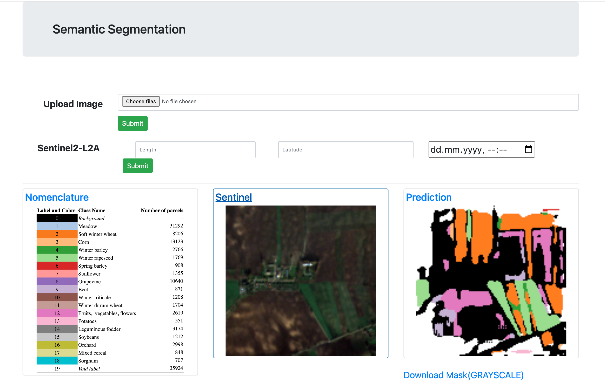

# satellites-internship

### Semantic segmenation of crop fields 




## Getting started

- Clone repo

```
git clone ...
cd satellites-internship
```

- Install dependencies

```
pip install -r requirements.txt
```

- Start training Unet3D(define in train.py path to dataset) 

```
python train.py
```

- Build web app image

```
docker build . --tag pastis
```

- Start web app

```
docker run -p 5000:5000 pastis
```
